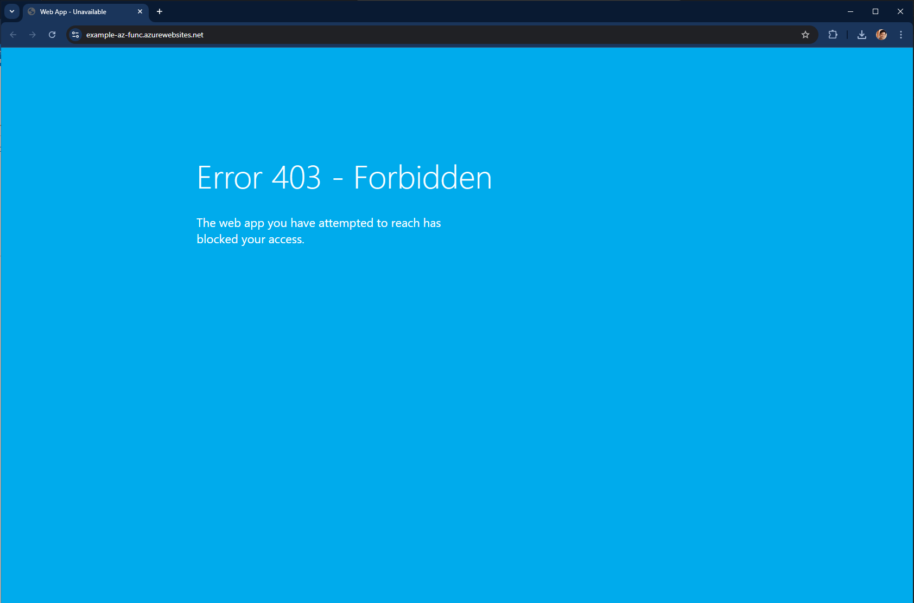
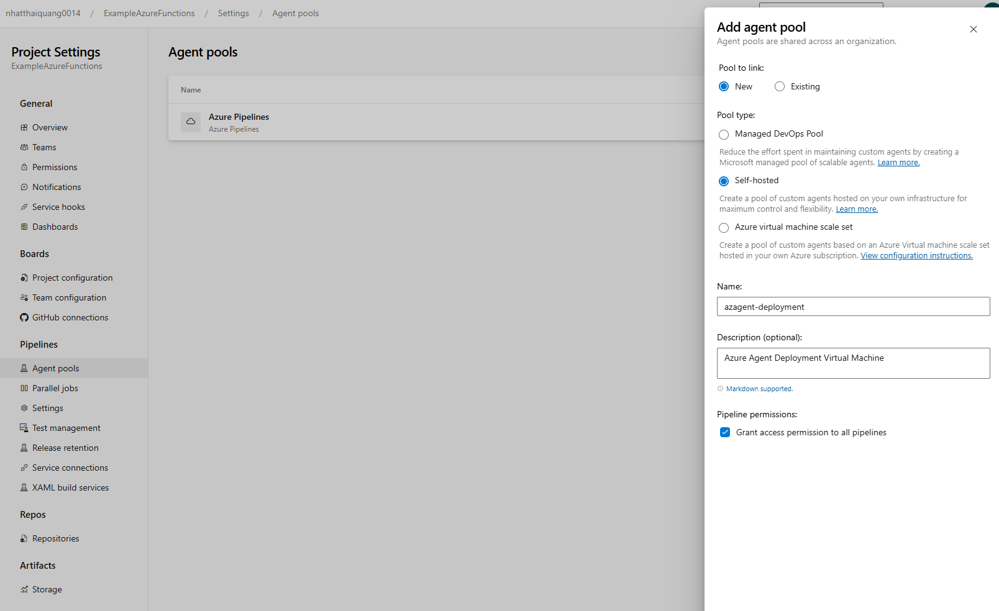
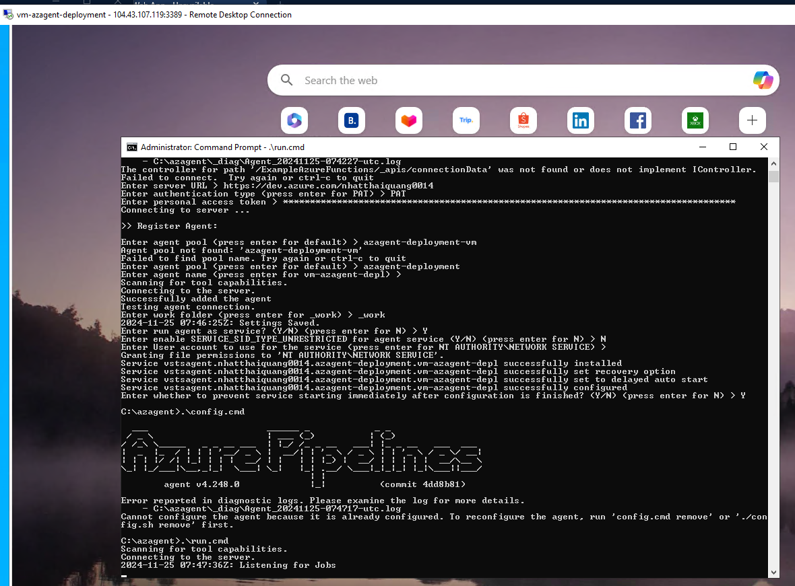

# Azure Function with Private Endpoint
    + Deploy the code to Azure Function with Private Endpoint via Azure DevOps
    + The Az Agent can deploy the Azure Function because they are the same virtual network.

### Create Manual Resources:
    + Create A Virtual Machine
    + Create an Azure Function with Private Endpoint
    + Create Azure DevOps
    + Create a Service Connection (Azure DevOps connects to the Azure Cloud)
    + Create an Agent Pool and Install into VM (private)
    + Deploy the Azure Function with deployment.yml file.

### Create Infrastructure with Terraform

### Notes:
    + For public HTTP Trigger: we will be mapped the Azure Function and an API Management for public the endpoint

### Result
+ 
+ 
+ 
+ 
+ 
+ 
+ 

### References
+ [Inbound Private Endpoint in Azure Function](https://www.michaelscollier.com/inbound-private-endpoints-with-azure-functions/)